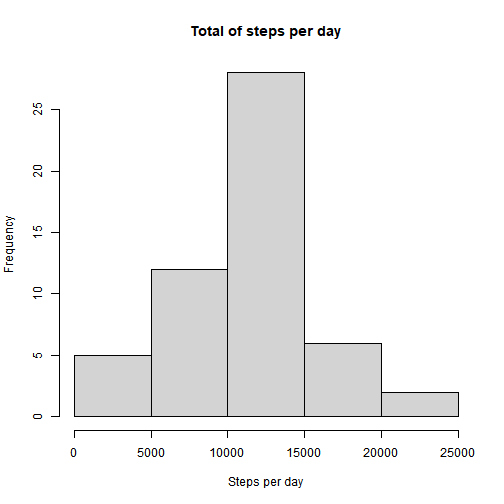
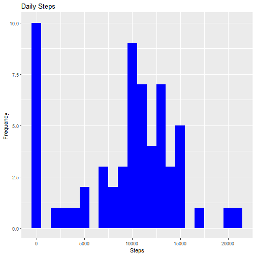
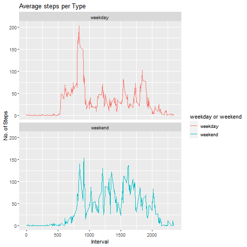

## Loading and preprocessing the data

```r
unzip(zipfile = "activity.zip")
activity=read.csv("activity.csv")
steps<-aggregate(steps~date,data=activity,sum,na.rm=TRUE)
```

## What is mean total number of steps taken per day?

```r
hist(
    steps$steps, 
    main = "Total of steps per day", 
    xlab="Steps per day", 
    ylab="Frequency"
)
```



```r
mean_steps <- mean(steps$steps)
median_steps <- median(steps$steps)
print(mean_steps)
```

```
## [1] 10766.19
```

```r
print(median_steps)
```

```
## [1] 10765
```

## What is the average daily activity pattern?

```r
stepsInterval<-aggregate(steps~interval,data=activity,mean,na.rm=TRUE)
plot(steps~interval,data=stepsInterval,type="l")
```


```r
stepsInterval[which.max(stepsInterval$steps),]$interval
```

```
## [1] 835
```

## Imputing missing values
* Calculate and report the total number of missing values in the dataset 

```r
number_na <- sum(is.na(activity$steps))
print(number_na)
```

```
## [1] 2304
```
* Devise a strategy for filling in all of the missing values in the dataset. The strategy does not need to be sophisticated. For example, you could use the mean/median for that day, or the mean for that 5-minute interval, etc.

```r
library("data.table")
library(ggplot2)
activityDT <- data.table::fread(input = "activity.csv")
activityDT[is.na(steps), "steps"] <- activityDT[, c(lapply(.SD, median, na.rm = TRUE)), .SDcols = c("steps")]
```

* Create a new dataset that is equal to the original dataset but with the missing data filled in

```r
data.table::fwrite(x = activityDT, file = "tidyData.csv", quote = FALSE)
```

* Make a histogram of the total number of steps taken each day and Calculate and report the mean and median total number of steps taken per day

```r
# total number of steps taken per day
Total_Steps <- activityDT[, c(lapply(.SD, sum)), .SDcols = c("steps"), by = .(date)] 
# mean and median total number of steps taken per day
Total_Steps[, .(Mean_Steps = mean(steps), Median_Steps = median(steps))]
```

```
##    Mean_Steps Median_Steps
## 1:    9354.23        10395
```

```r
ggplot(Total_Steps, aes(x = steps)) + geom_histogram(fill = "blue", binwidth = 1000) + labs(title = "Daily Steps", x = "Steps", y = "Frequency")
```



* Do these values differ from the estimates from the first part of the assignment? What is the impact of imputing missing data on the estimates of the total daily number of steps?

```r
cat("First with na",mean_steps,median_steps)
```

```
## First with na 10766.19 10765
```

```r
cat("Second with no na",mean(Total_Steps$steps),median(Total_Steps$steps))
```

```
## Second with no na 9354.23 10395
```
## Are there differences in activity patterns between weekdays and weekends?

```r
activityDT <- data.table::fread(input = "activity.csv")
activityDT[, date := as.POSIXct(date, format = "%Y-%m-%d")]
activityDT[, `Day of Week`:= weekdays(x = date)]
activityDT[grepl(pattern = "Monday|Tuesday|Wednesday|Thursday|Friday", x = `Day of Week`), "weekday or weekend"] <- "weekday"
activityDT[grepl(pattern = "Saturday|Sunday", x = `Day of Week`), "weekday or weekend"] <- "weekend"
activityDT[, `weekday or weekend` := as.factor(`weekday or weekend`)]
```
* Make a panel plot containing a time series plot (i.e. type = "l") of the 5-minute interval (x-axis) and the average number of steps taken, averaged across all weekday days or weekend days (y-axis). The plot should look something like the following, which was creating using simulated data:

```r
activityDT[is.na(steps), "steps"] <- activityDT[, c(lapply(.SD, median, na.rm = TRUE)), .SDcols = c("steps")]
IntervalDT <- activityDT[, c(lapply(.SD, mean, na.rm = TRUE)), .SDcols = c("steps"), by = .(interval, `weekday or weekend`)] 

ggplot(IntervalDT , aes(x = interval , y = steps, color=`weekday or weekend`)) + geom_line() + labs(title = "Average steps per Type", x = "Interval", y = "No. of Steps") + facet_wrap(~`weekday or weekend` , ncol = 1, nrow=2)
```


